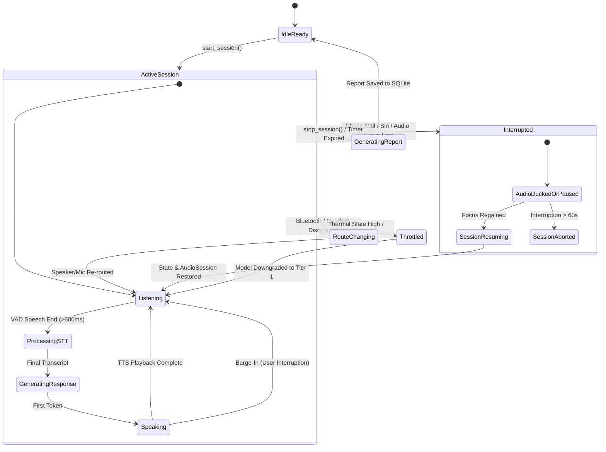

# 🏗️ Product Architecture Document (PAD) v1.1
## Deutsch-lehrerin: Sovereign Voice-Learning Runtime & Platform

**Document Version**: 1.1.0 (Hardened Production Specification)  
**Status**: 🟢 Architecture Hardened — Ready for Implementation Sign-Off  
**Target Platforms**: macOS, Windows, Linux, iOS (16+), Android (API 33+)  
**Core Stack**: Rust Domain Core + Tauri 2.11 + React 19 + Swift (iOS) + Kotlin (Android)  

---

## 1. Architectural Philosophy & Core Tenet

> **Core Axiom**: *Deutsch-lehrerin is not fundamentally a web app wrapped in Tauri. It is a **sovereign, cross-platform voice-learning runtime**, where Rust owns domain logic and orchestration, native Swift/Kotlin own platform audio and hardware capabilities, and React 19 acts purely as an observing presentation layer.*

```
┌─────────────────────────────────────────────────────────────────────────────┐
│                       1. PRESENTATION LAYER (React 19)                      │
│   • Pure Observer & Controller (Zero direct hardware/audio access)          │
│   • Visualizer HUD, Transcript Stream, Grammar Highlights, Scenario Lab     │
└──────────────────────────────────────┬──────────────────────────────────────┘
                                       │ UI IPC Plane
                                       │ (Tauri invoke / Event Listeners)
┌──────────────────────────────────────▼──────────────────────────────────────┐
│                    2. RUST APPLICATION & DOMAIN CORE                        │
│ ┌─────────────────────────┐ ┌───────────────────────┐ ┌───────────────────┐ │
│ │     LEARNING ENGINE     │ │   INFERENCE ROUTER    │ │ SOVEREIGNTY ENGINE│ │
│ │ • Skill Model (CEFR)    │ │ • Tier 1: 1.5B–3B     │ │ • Mode A: Device  │ │
│ │ • Error Model (Grammar) │ │ • Tier 2: 3B–7B       │ │ • Mode B: Home LAN│ │
│ │ • FSRS v4 Scheduler     │ │ • Tier 3: 7B+ Desktop │ │ • Mode C: BYOK SSL│ │
│ │ • Lesson/Session/Turn   │ │ • Tier 4: Home 14B–32B│ │                   │ │
│ └─────────────────────────┘ └───────────────────────┘ └───────────────────┘ │
│ ┌─────────────────────────────────────────────────────────────────────────┐ │
│ │ SECURE STORAGE ENGINE (SQLCipher Encrypted SQLite + Versioned Migrations)│ │
│ └─────────────────────────────────────────────────────────────────────────┘ │
└──────────────────────────────────────┬──────────────────────────────────────┘
                                       │ Runtime IPC Plane (Native Bridge)
                                       │ (C-FFI / Rust-to-Swift / Rust-to-Kotlin)
┌──────────────────────────────────────▼──────────────────────────────────────┐
│                    3. NATIVE PLATFORM AUDIO RUNTIMES                        │
│ ┌─────────────────────────────────────────┐ ┌─────────────────────────────┐ │
│ │ iOS Native (Swift)                      │ │ Android Native (Kotlin)     │ │
│ │ • AVAudioSession (.voiceChat + AEC)     │ │ • AudioFocus / AAudio       │ │
│ │ • SFSpeechRecognizer (On-device Neural) │ │ • Foreground Audio Service  │ │
│ │ • AVSpeechSynthesizer                   │ │ • On-Device SpeechRecognizer│ │
│ │ • Vision OCR (VNRecognizeTextRequest)   │ │ • Google ML Kit Text OCR    │ │
│ │ • Interruption Handler (Call/Route/Siri)│ │ • Audio Interruption Manager│ │
│ └─────────────────────────────────────────┘ └─────────────────────────────┘ │
└─────────────────────────────────────────────────────────────────────────────┘
```

---

## 2. Dual-Plane IPC Architecture

To guarantee that background sessions, audio interruptions, and hardware lifecycle survive WebView throttling, the architecture strictly decouples communication into **two distinct IPC planes**:

```
                 ┌──────────────────────────┐
                 │     React 19 UI          │
                 └─────────────┬────────────┘
                               │
                          UI IPC Plane
                    (Tauri Commands / Events)
                               │
                 ┌─────────────▼────────────┐
                 │     Rust Core Engine     │
                 └─────────────┬────────────┘
                               │
                       Runtime IPC Plane
                  (C-FFI / Native Channels)
                               │
              ┌────────────────┴────────────────┐
              ▼                                 ▼
   ┌────────────────────┐            ┌────────────────────┐
   │  iOS Native Bridge │            │ Android Native Br. │
   │  (Swift / Obj-C++) │            │ (Kotlin / JNI)     │
   └────────────────────┘            └────────────────────┘
```

1. **UI IPC Plane (Presentation)**:
   * **Mechanism**: Tauri `invoke()` and `app.emit()`.
   * **Responsibility**: Rendering transcripts, visualizer waveforms, setting changes, and user navigation.
   * **Rule**: When WebView JS is suspended in the background, **UI IPC drops to idle**. Zero business logic depends on UI IPC survival.
2. **Runtime IPC Plane (System & Audio Execution)**:
   * **Mechanism**: Direct Native C-ABI / FFI bindings between Rust and Swift (`swift-bridge` / C-FFI) and Kotlin (`JNI` / `uniffi`).
   * **Responsibility**: Real-time microphone buffer streaming, AEC, VAD trigger events, TTS playback state, audio route changes, and background continuation.

---

## 3. P0: Native Voice Runtime & Audio Engineering

### A. iOS Audio Pipeline (.voiceChat + AEC)
*   **Correction from v1.0**: Replaced `.measurement` with `.playAndRecord` and mode `.voiceChat`.
*   **Acoustic Echo Cancellation (AEC)**: `AVAudioSessionModeVoiceChat` automatically enables hardware-level full-duplex AEC and Automatic Gain Control (AGC). This is mandatory for **Barge-in** (user speaking while AI teacher is playing audio through the speaker).
*   **Configuration**:
    ```swift
    // Swift Audio Session Initializer
    let session = AVAudioSession.sharedInstance()
    try session.setCategory(
        .playAndRecord,
        mode: .voiceChat,
        options: [.defaultToSpeaker, .allowBluetooth, .allowBluetoothA2DP]
    )
    try session.setActive(true, options: .notifyOthersOnDeactivation)
    ```

### B. Decoupled Audio Pipeline (React as Observer)
React is completely decoupled from the real-time audio pipeline. Audio never passes through JavaScript strings or buffers:

```
[Microphone] ──► [Native VAD] ──► [On-Device STT]
                                         │
                                   (Runtime IPC)
                                         ▼
                               [Conversation Runtime]
                                         │
                                         ▼
                                [Inference Router]
                                         │
                                         ▼
[Speaker]    ◄── [Native TTS] ◄── [Teacher Turn Token Stream]
    │
    └──── (Domain Events) ─────► [React UI Visualizer & Transcript]
```

---

## 4. P0: Interruption, Failure & Recovery State Machine

Production mobile voice apps must handle phone calls, Bluetooth disconnects, and thermal throttling without crashing or desynchronizing state:



### Handled Interruption Matrix:
| Trigger | System Behavior | Recovery Action |
|---|---|---|
| **Incoming Phone Call / Alarm** | `AVAudioSessionInterruptionTypeBegan` → Pause session, release mic, freeze turn state. | `InterruptionTypeEnded` with `.shouldResume` → Reactivate audio session, resume listening. |
| **AirPods / Bluetooth Disconnect** | `AVAudioSessionRouteChangeReasonOldDeviceUnavailable` → Pause TTS immediately (prevent blasting speaker). | Switch to phone earpiece/speaker, prompt user with audio tone. |
| **App Backgrounding (Screen Lock)** | Maintain background audio playback. Pause continuous STT. | On screen unlock / app active → Instantly resume listening loop. |
| **Thermal Throttling / Low Battery** | Detect `ProcessInfo.ThermalState.serious` → Inference Router downgrades from Tier 2 to Tier 1 model. | Restore model tier when thermal state cools. |

---

## 5. P1: 4-Tier Inference Router & Capability Matrix

The **Inference Router** abstracts local, LAN, and cloud providers behind a unified asynchronous streaming interface:

```
                          ┌───────────────────────────┐
                          │     Inference Router      │
                          └─────────────┬─────────────┘
                                        │
         ┌──────────────────┬───────────┴───────────┬──────────────────┐
         ▼                  ▼                       ▼                  ▼
┌─────────────────┐┌─────────────────┐┌──────────────────┐┌──────────────────┐
│ TIER 1 (Mobile) ││ TIER 2 (Pro)    ││ TIER 3 (Desktop) ││ TIER 4 (Home AI) │
├─────────────────┤├─────────────────┤├──────────────────┤├──────────────────┤
│ Qwen 2.5 1.5B   ││ Qwen 2.5 3B/7B  ││ Llama 3.3 8B     ││ Qwen 32B /       │
│ SmolLM2 1.7B    ││ Mistral 7B Q4   ││ Qwen 2.5 14B     ││ Llama 70B        │
│ RAM: 1.2–2 GB   ││ RAM: 3–6 GB     ││ RAM: 8–16 GB     ││ RAM: 16–64 GB    │
│ Target: Mobile  ││ Target: Apple M ││ Target: Desktop  ││ Target: LAN Host │
└─────────────────┘└─────────────────┘└──────────────────┘└──────────────────┘
```

### Capability Manager Auto-Detection Rules:
```rust
pub enum InferenceTier {
    Tier1_MobileUltraLight, // <4GB RAM or Battery Saver mode
    Tier2_MobileFlagship,   // >=8GB RAM (A17 Pro, M-series, Snapdragon 8 Gen 3)
    Tier3_DesktopLocal,     // Desktop with dedicated GPU / Apple Silicon
    Tier4_HomeSovereignLAN, // Authenticated LAN server (Ollama / vLLM)
    Cloud_BYOK_GroqGemini,  // Explicit user-configured BYOK fallback
}
```

---

## 6. P1: Sovereignty Policy Engine & Network Boundaries

```
┌─────────────────────────────────────────────────────────────────────────────┐
│ MODE A: DEVICE SOVEREIGN (Zero Network)                                     │
│ • Air-gapped: Complete network isolation (No Wi-Fi / No Cellular required). │
│ • STT: On-device Apple Neural Engine / Android On-Device Speech.            │
│ • LLM: Embedded llama.cpp (Tier 1/2 GGUF).                                  │
│ • TTS: On-device native OS neural voice.                                    │
└─────────────────────────────────────────────────────────────────────────────┘

┌─────────────────────────────────────────────────────────────────────────────┐
│ MODE B: HOME SOVEREIGN (Authenticated LAN)                                  │
│ • Network: Strictly bound to Local Subnet via TLS & Shared Secret.          │
│ • Discovery & Pairing: mDNS + Ed25519 QR-Code Handshake.                    │
│ • Zero egress to public internet. Encrypted over local Wi-Fi.               │
└─────────────────────────────────────────────────────────────────────────────┘

┌─────────────────────────────────────────────────────────────────────────────┐
│ MODE C: BYOK ACCELERATION (User-Owned Cloud SSL)                            │
│ • Network: Direct SSL socket to user's provider (Groq / Gemini / OpenRouter)│
│ • Key Storage: Stored strictly in OS Keychain (Apple Keychain / Keystore).  │
│ • No intermediate proxy server. Zero vendor telemetry.                     │
└─────────────────────────────────────────────────────────────────────────────┘
```

---

## 7. P2: Pedagogical Architecture (The Learning Engine)

The LLM is a language generator, **not the owner of learner progression**. Pedagogical progression is owned by the Rust **Learning Engine**:

```
                       ┌─────────────────────────┐
                       │     LEARNING ENGINE     │
                       └────────────┬────────────┘
                                    │
        ┌───────────────────────────┼───────────────────────────┐
        ▼                           ▼                           ▼
┌──────────────┐            ┌──────────────┐            ┌──────────────┐
│ SKILL MODEL  │            │ ERROR MODEL  │            │ FSRS ENGINE  │
├──────────────┤            ├──────────────┤            ├──────────────┤
│ CEFR A1-C1   │            │ Dativ/Akk    │            │ Free Spaced  │
│ Grammar Map  │            │ Gender (d/d/d│            │ Repetition   │
│ Lexicon Tree │            │ Pronunciat.  │            │ Scheduler v4 │
└──────────────┘            └──────────────┘            └──────────────┘
```

### Domain Hierarchy: `Lesson` ➔ `Session` ➔ `Turn`

```
Lesson (Objective: "Order Food & Complain about the Bill - A2/B1")
  │
  ├── Session 1 (2026-08-11 08:30 — Duration: 12 min — Completed)
  │     ├── Turn 1 (User: "Ich will ein Bier" ➔ Teacher: "Besser: 'Ich hätte gern ein Bier'")
  │     ├── Turn 2 (User: "Das Suppe ist kalt" ➔ Teacher: "[Korrektur: 'Die Suppe' (Feminin)]")
  │     └── Turn 3 (...)
  │
  └── Session 2 (Review Drill — 5 min)
```

---

## 8. Hardened Storage Layer (Encrypted SQLite + Migrations)

### A. Versioned Migration Engine
Replaces raw `CREATE TABLE IF NOT EXISTS` with transactional, versioned schema migrations:

```sql
-- Migration 001_initial_schema.sql
CREATE TABLE schema_migrations (
    version INTEGER PRIMARY KEY,
    applied_at DATETIME DEFAULT CURRENT_TIMESTAMP
);

CREATE TABLE lessons (
    id TEXT PRIMARY KEY,
    cefr_level TEXT NOT NULL CHECK(cefr_level IN ('A1','A2','B1','B2','C1')),
    title TEXT NOT NULL,
    scenario_type TEXT NOT NULL,
    target_grammar_rules TEXT NOT NULL -- JSON array
);

CREATE TABLE sessions (
    id TEXT PRIMARY KEY,
    lesson_id TEXT,
    start_timestamp INTEGER NOT NULL,
    duration_seconds INTEGER NOT NULL,
    completed_normally BOOLEAN NOT NULL DEFAULT 1,
    FOREIGN KEY(lesson_id) REFERENCES lessons(id)
);

CREATE TABLE turns (
    id TEXT PRIMARY KEY,
    session_id TEXT NOT NULL,
    turn_index INTEGER NOT NULL,
    user_audio_duration_ms INTEGER,
    user_transcript TEXT NOT NULL,
    teacher_response TEXT NOT NULL,
    corrections_json TEXT,
    timestamp INTEGER NOT NULL,
    FOREIGN KEY(session_id) REFERENCES sessions(id) ON DELETE CASCADE
);

CREATE TABLE fsrs_flashcards (
    id TEXT PRIMARY KEY,
    turn_id TEXT,
    german_text TEXT NOT NULL,
    english_translation TEXT NOT NULL,
    grammar_category TEXT NOT NULL,
    state INTEGER NOT NULL DEFAULT 0, -- 0=New, 1=Learning, 2=Review, 3=Relearning
    stability REAL NOT NULL DEFAULT 0.0,
    difficulty REAL NOT NULL DEFAULT 0.0,
    elapsed_days INTEGER NOT NULL DEFAULT 0,
    scheduled_days INTEGER NOT NULL DEFAULT 0,
    reps INTEGER NOT NULL DEFAULT 0,
    lapses INTEGER NOT NULL DEFAULT 0,
    last_review_timestamp INTEGER,
    due_timestamp INTEGER NOT NULL,
    FOREIGN KEY(turn_id) REFERENCES turns(id) ON DELETE SET NULL
);

CREATE TABLE fsrs_review_logs (
    id TEXT PRIMARY KEY,
    card_id TEXT NOT NULL,
    rating INTEGER NOT NULL CHECK(rating BETWEEN 1 AND 4), -- 1=Again, 2=Hard, 3=Good, 4=Easy
    review_timestamp INTEGER NOT NULL,
    scheduled_days INTEGER NOT NULL,
    FOREIGN KEY(card_id) REFERENCES fsrs_flashcards(id) ON DELETE CASCADE
);

-- Performance Indexes
CREATE INDEX idx_turns_session ON turns(session_id, turn_index);
CREATE INDEX idx_flashcards_due ON fsrs_flashcards(due_timestamp, state);
CREATE INDEX idx_review_logs_card ON fsrs_review_logs(card_id, review_timestamp);
```

### B. Encryption at Rest
Database encryption is provided by **SQLCipher / SQLite Encryption Extension** using keys derived from the OS hardware vault:
* **iOS**: 256-bit AES key generated and stored in **Apple Secure Enclave / Keychain** (`kSecAttrAccessibleAfterFirstUnlock`).
* **Android**: Key generated via **Android Keystore System** (`MasterKey.Builder`).

---

## 9. Revised Sign-Off & Implementation Approval

### Architecture Board Evaluation

| Requirement Area | Status in v1.0 | Status in v1.1 (Current) | Sign-Off |
|---|---|---|---|
| **iOS Audio Pipeline** | 🔴 `.measurement` bug | 🟢 `.voiceChat` + full-duplex AEC + Barge-in | ✅ APPROVED |
| **Dual-Plane IPC** | 🔴 Missing Native-Rust bridge | 🟢 Explicit UI vs Runtime FFI planes | ✅ APPROVED |
| **Background Execution** | 🔴 Unrealistic continuous mic | 🟢 Foreground Full-Duplex + Safe Continuation | ✅ APPROVED |
| **Audio Interruptions** | 🔴 No state recovery | 🟢 Comprehensive Interruption State Machine | ✅ APPROVED |
| **Inference Strategy** | 🟠 Single model assumption | 🟢 4-Tier Inference Router (1.5B ➔ 32B) | ✅ APPROVED |
| **Sovereignty Network Policy**| 🟠 Contradictory definitions | 🟢 Strict Mode A (Zero Net), Mode B (LAN), Mode C (BYOK) | ✅ APPROVED |
| **Database & Security** | 🟠 MVP unindexed SQLite | 🟢 Versioned Migrations + SQLCipher Encryption | ✅ APPROVED |
| **Learning Engine** | 🟡 Missing pedagogy domain | 🟢 FSRS v4 + Skill Model + Lesson/Session/Turn | ✅ APPROVED |

---

### Final Implementation Approval
*   **Architecture Status**: **🟢 APPROVED FOR FULL IMPLEMENTATION**
*   **Version**: 1.1.0 (Hardened)
*   **Lead Architect**: Praveen Kasam  
*   **Implementation Ready**: All P0, P1, and P2 blockers resolved.
